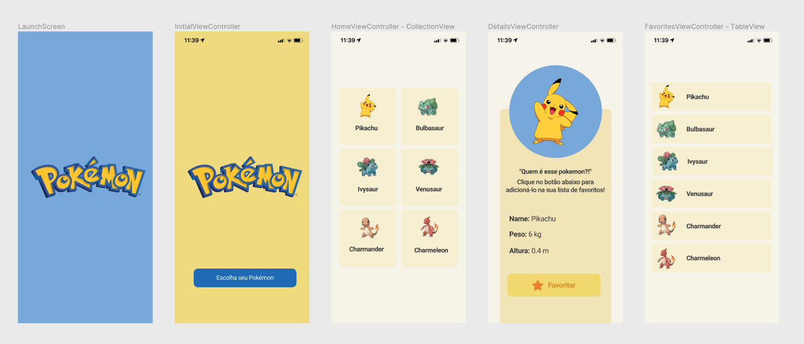

## 📱 ProjetoFinal - Pokedex App

Projeto final do curso de Swift do programa Maria vai com as Devs realizado pela Serasa e Gama Academy para capacitar Desenvolvedoras iOS.

## 📄  Sobre o Projeto

*GIF do projeto!

## 📌  Requisitos do Projeto

- [x] Chamada API para trazer dados
- [x] Mostrar pelo menos uma imagem externa
- [x] Pelo menos uma lista com scroll (com dados externos)
- [x] Persistência de dados
- [x] Ter pelo menos um teste unitário (não precisa ser TDD)

**Dicas:**
- Testar em vários tamanhos de tela (iPhone)
- Quando não houver internet o app deve avisar o usuário e os dados persistidos devem funcionar normalmente

## 🌈  Protótipo

Para visualizar o projeto no Figma [clique aqui](https://www.figma.com/file/PdyGNBmOVnV5M2cefsPtDm/Projeto-Final---PokeAPI?node-id=0%3A1). 💻

## ✨  Arquitetura e Tecnologias utilizadas

- MVC Architecture
- Pod Kingfisher

---

Desenvolvido com ❤️ por [Rayana Prata](https://www.linkedin.com/in/rayanaprata), [Elisa Kalil](https://github.com/elisakalil) e [Marilise Morona](https://github.com/MariliseMorona).
